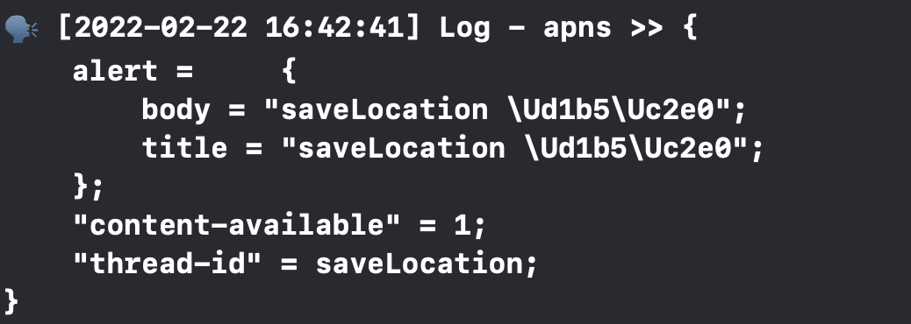
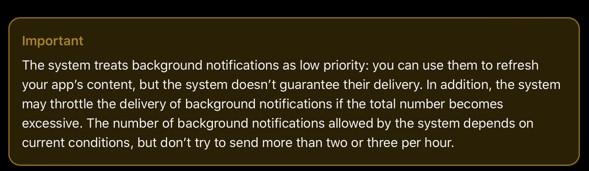

# 환경

- GCP setting
  - region : 오사카
  - 삭제 보호 : 설정됨
  - 부팅디스크
    - 운영체제 : ubuntu
  - 방화벽 : HTTP 트래픽
  - 고정 IP
  - port opened
    - 22, 80, 443, 8000, 8080, 8888, 9000
  - https 인증
- 도커 version 3.7
  - django-gunicorn 컨테이너 (custom image 기반)
  - nginx 1.19.5 컨테이너
  - mariadb 10.5 컨테이너

# 목적

- BE에서 FE의 앱을 깨워 다음의 동작을 수행하게 하기 위함
  - 유형1
    - **앱을 깨워서 GPS 로그를 한번 찍어 로컬 device에 저장하게 한다.**
    - GPS 로그를 더 잦은 주기로 찍어 저장해 사용자가 머문 장소를 정밀하게 detection 하기 위함
  - 유형2
    - **목적1 : 사용자에게 일주일동안 쌓인 일정을 확인해보라는 안내 알림**
    - **목적2 : 사용자가 앱을 열어보지 않더라도 POST 통신을 통해 FE가 저장하고 있는 사용자의 모든 위치데이터를 넘겨 받음**

# TEST

## FCM통신 1

- thread_id="saveLocation"

- 기능 : 로컬 DB에 데이터를 저장하기 위함

- 방법 : silent push

- 주기 : 30분에 한번

  

### 시나리오 1: 통신 시 제대로 오는지 확인

|                   | Foreground   | Background   | Suspend      |
| ----------------- | ------------ | ------------ | ------------ |
| Silent 알람 여부  | O (16:42:41) | O (16:45:41) | O (17:00:01) |
| 로컬 DB 저장 여부 | O (16:42:41) | O (16:45:41) | O (17:00:01) |

**Foreground**

**Background**

**Suspend**

### 시나리오 2: 1시간에 2개씩 오는지 확인

|                   | Suspend |
| ----------------- | ------- |
| 알람 여부         | O       |
| 로컬 DB 저장 여부 | X       |

- 불행하게도 데이터의 저장 로직이 작동하지 않을 때가 많음
- OS가 알림을 차단하는 것으로 추정

> 참고 [Apple Developer Documentation](https://developer.apple.com/documentation/usernotifications/setting_up_a_remote_notification_server/pushing_background_updates_to_your_app)
>
> 

## FCM통신 2

  - thread_id="pathDaily"
  - 기능 : "알림" + "path/daily"
  - 방법 : remote push
  - 일요일 (24:10:00)
  - 메세지 내용 : "일주일 동안의 기록을 확인해보세요!"

### 시나리오: 특정시간에 알림이 오는지 확인 + path/daily 작동하는지 확인

|                | Suspend |
| -------------- | ------- |
| 알림 작동 여부 | O       |
| 통신 여부      | X       |

- 앱을 켜지 않은 상태에서는 네트워크 통신이 제대로 이루어지지 않는 것으로 추정